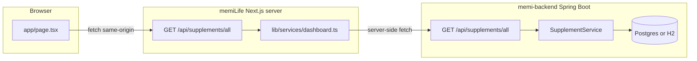
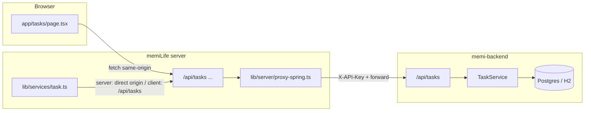

# MemiLife — โครงสร้างระบบ (หน้าบ้าน · หลังบ้าน · ฐานข้อมูล)

เอกสารนี้อธิบาย **สอง repo** ที่ทำงานคู่กัน: repo นี้คือ **memiLife** (Next.js) และ **memi-backend** (Spring Boot) โดยทั่วไป clone คู่กันบนเครื่อง (เช่น `C:\memiLife` กับ `C:\memi-backend`)

---

## 1) ภาพรวมและขอบเขต



- **หน้าบ้าน** โหลดข้อมูลผ่าน **`/api/supplements/all`** เท่านั้น (ไม่เรียก Railway/8080 ตรงจาก browser เพื่อเลี่ยง CORS และซ่อน URL จริงฝั่ง server ได้)
- **Next server** ดึงรายการจาก Spring แล้ว **จัดกอง noon/night** ก่อนส่ง JSON ให้ client
- **ฐานข้อมูล** ถูกดูแลโดย **Flyway** ใน memi-backend; entity JPA ต้องสอดคล้องกับคอลัมน์

### 1b) Tasks (Memi Task) — flow



- หน้า **`/tasks`** (server component) เรียก **`getAllTasks()`** → บน server ดึง **`{origin}/api/tasks`**; ใน browser เรียก **`/api/tasks`** แล้วให้ Route Handler proxy ไป Spring
- Response ของ task API ใช้ **`{ success, data, message? }`** (`ApiResponse`) — ฝั่ง **`lib/services/task.ts`** จะ **unwrap `data`**
- Mutation (POST/PATCH/DELETE): proxy ส่ง **`X-API-Key`** จาก header ของ request หรือจาก **`MEMI_BACKEND_API_KEY`** (env บน Vercel)

---

## 2) Repository: memiLife (repo นี้)

### เทคโนโลยี

| ชั้น | เทคโนโลยี |
|-----|------------|
| Framework | Next.js **16** (App Router), React **19** |
| UI | Tailwind **4**, Radix UI, shadcn-style components ใต้ `components/ui/` |
| PWA | `@ducanh2912/next-pwa` (ดู `next.config.mjs`) |

### โครงสร้างโฟลเดอร์หลัก

```
memiLife/
├── app/
│   ├── layout.tsx
│   ├── page.tsx                # dashboard (client); fetchDashboardData()
│   ├── tasks/
│   │   └── page.tsx            # Memi Task — server: getAllTasks() → TaskList
│   ├── providers.tsx
│   ├── globals.css
│   ├── manifest.ts
│   └── api/
│       ├── supplements/
│       │   └── all/
│       │       └── route.ts    # GET → getDashboardPayload()
│       └── tasks/
│           ├── route.ts                    # GET/POST proxy → /api/tasks
│           ├── [id]/
│           │   ├── route.ts                # GET/PATCH/DELETE
│           │   ├── schedule/route.ts       # PATCH schedule
│           │   └── timer/[action]/route.ts # PATCH start|pause|stop
├── components/
│   ├── dashboard/              # header (ลิงก์ Tasks → /tasks), fasting, supplements, …
│   ├── task/                   # task-list, task-form, task-timer, schedule-edit, task-delete-dialog
│   └── ui/
├── lib/
│   ├── server/
│   │   └── proxy-spring.ts     # forward ไป Spring + X-API-Key
│   ├── utils.ts
│   └── services/
│       ├── dashboard.ts        # supplements + export backendOriginForServer()
│       └── task.ts             # CRUD/schedule/timer; unwrap ApiResponse
├── types/
│   └── task.ts                 # Task, TaskWriteBody, ApiEnvelope, …
├── hooks/
├── public/
├── scripts/
│   └── run-local.cjs
├── next.config.mjs
├── tsconfig.json
├── package.json                # "lint": "tsc --noEmit"
└── .env.example                # MEMI_BACKEND_URL, NEXT_PUBLIC_API_URL, MEMI_BACKEND_API_KEY
```

### เส้นทางข้อมูล (dashboard supplements)

1. **`app/page.tsx`** (client) เรียก **`fetchDashboardData()`** จาก `lib/services/dashboard.ts`
2. ใน browser: **`fetch("/api/supplements/all", { cache: "no-store" })`**
3. **`app/api/supplements/all/route.ts`** เรียก **`getDashboardPayload()`** ซึ่ง:
   - resolve **backend origin** จาก env (ดูด้านล่าง)
   - `fetch(`${origin}/api/supplements/all`)` คาดหวัง **JSON array** จาก Spring
   - รัน **`buildDashboardFromRows()`** → โครงสร้าง **`DashboardPayload`** (`supplementStacks.noon` / `.night`)

### เส้นทางข้อมูล (Memi Task — `/tasks`)

1. **`app/tasks/page.tsx`** (server) เรียก **`getAllTasks()`** ใน `lib/services/task.ts` → `fetch(`${backendOriginForServer()}/api/tasks`)` พร้อม timeout
2. ใน browser: **`fetch("/api/tasks", …)`** → **`app/api/tasks/route.ts`** → **`proxySpring`** ไป **`GET {origin}/api/tasks`**
3. Spring คืน **`{ "success": true, "data": [ …Task… ] }`** — `task.ts` ใช้ **`unwrap` / `unwrapRequired`** อ่าน `data`
4. สร้าง/แก้/ลบงาน: **`POST|PATCH|DELETE /api/tasks/...`** ต้องมี **`X-API-Key`** ฝั่ง Spring; Next ใส่จาก **`MEMI_BACKEND_API_KEY`** หรือจาก header ที่ browser ส่งมา (ถ้ามี)

### ตัวแปรสภาพแวดล้อม (memiLife)

| ตัวแปร | ใครอ่าน | ความหมาย |
|--------|----------|-----------|
| `MEMI_BACKEND_URL` | **เฉพาะ Next server** | Base ของ Spring; **ใช้เฉพาะ origin** (ตัด path เช่น `/api/v1` ออกใน `toHttpOriginOnly`) |
| `MEMI_BACKEND_API_KEY` | **Next server** (Route Handlers) | ส่งเป็น **`X-API-Key`** ไป Spring เมื่อ client ไม่ได้แนบ header (ต้องตรงกับ `API_KEY` / `app.api.key` ของ backend) |
| `NEXT_PUBLIC_API_URL` | ลำดับรองสำหรับ origin + ใช้ hint ใน `logSupplement` | ถ้าไม่ตั้ง `MEMI_BACKEND_URL` อาจถูกใช้เป็น fallback ร่วมกับ dev default |
| `SUPPLEMENTS_API_ORIGIN` | server (fallback chain) | ทางเลือกเพิ่มใน `backendOriginForServer()` |

ลำดับความสำคัญโดยย่อในโค้ด: `MEMI_BACKEND_URL` → `SUPPLEMENTS_API_ORIGIN` → `NEXT_PUBLIC_API_URL` → ว่างแล้วใน **development** ใช้ `http://127.0.0.1:8080` → production ใช้ค่า default Railway ที่กำหนดใน `dashboard.ts` (ควรตั้ง env บน deploy จริง)

ไฟล์ตัวอย่าง: **`.env.example`**

### กฎการแบ่งกอง (noon / night)

นิยามใน **`lib/services/dashboard.ts`**:

- อ่านเวลาจาก **`doseTime`** หรือ **`dose_time`** เท่านั้น (รูปแบบ `HH:mm`)
- **05:00–16:59** → กองกลางวัน (**noon**)
- **17:00–04:59** (ข้ามเที่ยงคืน) → กองกลางคืน (**night**)
- ไม่มีค่า / parse ไม่ได้ → **noon**
- **`taken_time_slot` ไม่ใช้ในการแบ่งกอง**

### สคริปต์ `npm run local`

- ไฟล์: **`scripts/run-local.cjs`**
- ค้นหา backend ที่ **`../memi-backend`** จาก parent ของ memiLife หรือตั้ง **`MEMI_BACKEND_DIR`** เป็น path แบบ absolute
- Windows: สั่ง **`Start-Process mvnw.cmd spring-boot:run`** ใน working directory ของ backend แล้วรอ 5 วินาที จากนั้น **`npm run dev`**
- หมายเหตุ: สคริปต์ไม่ได้บังคับ profile **`h2`** — ขึ้นกับว่า backend ของคุณรันด้วย Postgres หรือ H2 (ดู memi-backend)

### สิ่งที่ยังไม่ persist

- **`logSupplement()`** ใน `dashboard.ts` ยังเป็น mock/console ไม่ได้ลดสต็อกผ่าน API

---

## 3) Repository: memi-backend (repo แยก)

โดยทั่วไป remote: `https://github.com/catBible/memi-backend.git` (ตรวจจาก `git remote` ในเครื่องคุณ)

### เทคโนโลยี

| ชั้น | เทคโนโลยี |
|-----|------------|
| Runtime | Java, **Spring Boot** |
| Build | Maven (`mvnw`, `pom.xml`) |
| ORM | Spring Data JPA + Hibernate (`ddl-auto=validate` ใน production) |
| DB migration | **Flyway** (`classpath:db/migration`) |
| API docs | springdoc / OpenAPI (`OpenApiConfig`) |
| Write protection | **`X-API-Key`** header เมื่อตั้ง `API_KEY` / `app.api.key` (`ApiKeyFilter`) |

### โครงสร้างแพ็กเกจ Java (`src/main/java/com/memi/lifeos/`)

```
com.memi.lifeos/
├── LifeOsBackendApplication.java      # entry
├── config/
│   ├── ApiKeyFilter.java               # writes ต้องมี API key (เมื่อกำหนด)
│   ├── SecurityConfig.java
│   ├── OpenApiConfig.java
│   └── DatabaseUrlEnvironmentPostProcessor.java   # แปลง DATABASE_URL (postgres://) → JDBC
├── web/
│   ├── LivenessController.java         # health / probes
│   └── dto/
│       └── ApiResponse.java            # envelope Task API: success, data, message
├── error/
│   ├── GlobalExceptionHandler.java
│   └── ResourceNotFoundException.java  # 404 (extends ResponseStatusException)
├── supplement/
│   ├── api/
│   │   └── SupplementController.java   # @RequestMapping("/api/supplements")
│   ├── entity/
│   │   └── Supplement.java             # JPA entity ↔ ตาราง supplements
│   ├── repository/
│   │   ├── SupplementRepository.java
│   │   └── SupplementQuerySpecs.java   # optional search q
│   ├── service/
│   │   └── SupplementService.java
│   ├── dto/
│   │   ├── SupplementResponse.java     # JSON ออก camelCase + @JsonAlias รับ snake_case
│   │   ├── SupplementWriteRequest.java
│   │   └── SupplementMapper.java
│   └── H2SupplementDevSeed.java        # seed เมื่อ profile h2 และตารางว่าง (เงื่อนไขในโค้ด)
└── task/
    ├── api/
    │   └── TaskController.java         # @RequestMapping("/api/tasks") → ResponseEntity<ApiResponse<…>>
    ├── entity/
    │   └── Task.java                   # tagsJson = TEXT เก็บ JSON array string เช่น []
    ├── repository/
    │   └── TaskRepository.java
    ├── service/
    │   └── TaskService.java            # soft delete, timer, schedule
    └── dto/
        ├── TaskResponse.java
        ├── TaskWriteRequest.java
        ├── TaskPatchRequest.java
        ├── UpdateScheduleRequest.java
        └── TaskMapper.java
```

### REST API — อาหารเสริม (`/api/supplements`)

| Method | Path | คำอธิบาย |
|--------|------|-----------|
| GET | `/api/supplements` | รายการแบบ **page** (+ optional `q`) |
| GET | `/api/supplements/all` | รายการ **ทั้งหมด** (ไม่ page) — ที่ dashboard ใช้ |
| GET | `/api/supplements/{id}` | รายการเดียว |
| POST | `/api/supplements` | สร้าง (ต้อง API key เมื่อเปิดใช้) |
| PUT | `/api/supplements/{id}` | แทนที่ทั้งก้อน |
| DELETE | `/api/supplements/{id}` | ลบ |

### REST API — งาน (`/api/tasks`)

ทุก response ห่อด้วย **`ApiResponse<T>`** (ยกเว้น health ฯลฯ). Write ต้อง **`X-API-Key`** เมื่อตั้ง `API_KEY` แล้ว

| Method | Path | คำอธิบาย |
|--------|------|-----------|
| GET | `/api/tasks` | รายการที่ยังไม่ soft-delete |
| GET | `/api/tasks/{id}` | รายการเดียว |
| POST | `/api/tasks` | สร้าง |
| PATCH | `/api/tasks/{id}` | แก้บางฟิลด์ |
| DELETE | `/api/tasks/{id}` | soft delete (`deleted_at`) |
| PATCH | `/api/tasks/{id}/schedule` | `scheduledAt`, `endAt`, `dueAt` |
| PATCH | `/api/tasks/{id}/timer/start` | เริ่มจับเวลา |
| PATCH | `/api/tasks/{id}/timer/pause` | หยุดชั่วคราว + สะสมวินาที |
| PATCH | `/api/tasks/{id}/timer/stop` | หยุด + อัปเดต `actualMinutes` |

### การตั้งค่ารัน (`src/main/resources/`)

- **`application.properties`** — พอร์ต `PORT` หรือ 8080, Flyway เปิด, JPA `validate`, `app.api.key`, CORS patterns
- **`application-h2.properties`** — H2 in-memory, **Flyway ปิด**, JPA `update`, `app.api.key` สำหรับ dev
- **`local.properties`** — optional override (import แบบ optional จาก `application.properties`)
- **`local.properties.example`** — ตัวอย่าง

### การเชื่อม Postgres (Railway / cloud)

- ตั้ง **`DATABASE_URL`** แบบ `postgres://...` หรือ `postgresql://...`
- **`DatabaseUrlEnvironmentPostProcessor`** จะ map เป็น `spring.datasource.url` / username / password ก่อน boot ถ้ายังไม่มี `spring.datasource.url`

### SQL มือ (`memi-backend/db/manual/`)

| ไฟล์ | ใช้เมื่อ |
|------|----------|
| `add_supplement_dose_and_meal.sql` | แก้คอลัมน์ supplement บน DB ที่มีอยู่แล้ว |
| `create_tasks_table_postgres.sql` | **สร้างตาราง `tasks` ทันที** ใน SQL Editor (Railway/Supabase) เมื่อ Flyway ยังไม่สร้าง |
| `README.md` | เช็คลิสต์ Flyway vs manual |

---

## 4) ฐานข้อมูล — ตาราง `supplements`

### Flyway (ลำดับใน repo)

ไฟล์อยู่ที่ **`memi-backend/src/main/resources/db/migration/`**

| Version | ไฟล์ | หน้าที่โดยย่อ |
|---------|------|----------------|
| V1 | `V1__init_supplements.sql` | สร้างตารางเริ่มต้น (มีคอลัมน์ legacy เช่น `form`, `notes`, `created_at`) |
| V3 | `V3__supplements_lifeos_shape.sql` | ดึงรูปแบบให้ใกล้ production: `stock_remaining`, `taken_time_slot`, `last_taken_at`; ลบคอลัมน์เก่า |
| V4 | `V4__dose_time.sql` | เพิ่ม **`dose_time`** (VARCHAR 8, รูปแบบเวลา HH:mm) |
| V5 | `V5__meal_timing.sql` | เพิ่ม **`meal_timing`** (VARCHAR 32; ค่าแนะนำ `before` / `after`) |

หมายเหตุ: **ไม่มี V2** ใน repo ปัจจุบัน (ข้ามเลขเวอร์ชันเพื่อหลีกเลี่ยง conflict ตามคอมเมนต์ใน V3)

### Flyway — ตาราง `tasks`

| Version | ไฟล์ | หน้าที่โดยย่อ |
|---------|------|----------------|
| V6 | `V6__tasks.sql` | สร้าง `tasks` (เดิม `tags` เป็น `TEXT[]`) |
| V7 | `V7__tasks_tags_text_json.sql` | ถ้า `tags` ยังเป็น PostgreSQL **`_text` array** ให้แปลงเป็น **`TEXT`** เก็บ JSON array string |
| V8 | `V8__tasks_ensure_table.sql` | **`CREATE TABLE IF NOT EXISTS`** รูปแบบสุดท้าย (`tags` = TEXT default `'[]'`) กันครั้งที่ตารางยังไม่ถูกสร้าง |

- Entity **`Task.tagsJson`**: คอลัมน์ `tags` เป็น **TEXT** ค่าเช่น **`[]`** หรือ **`["a","b"]`** — หลีกเลี่ยงปัญหา JDBC กับ `text[]` บน production  
- ถ้า Flyway ไม่รันบน DB ที่ใช้จริง: รัน **`db/manual/create_tasks_table_postgres.sql`** ใน SQL Editor แล้ว redeploy backend

### คอลัมน์ที่สอดคล้องกับ `Supplement.java`

| DB column | Java field | หมายเหตุ |
|-----------|------------|---------|
| `id` | `Integer id` | SERIAL / identity |
| `name` | `name` | NOT NULL |
| `brand` | `brand` | |
| `dosage` | `dosage` | |
| `stock_remaining` | `stockRemaining` | NOT NULL, default 0 |
| `taken_time_slot` | `takenTimeSlot` | ป้ายกำกับเชิงข้อความ (ไม่ใช้แบ่งกองใน Next) |
| `dose_time` | `doseTime` | HH:mm สำหรับ logic กองกลางวัน/กลางคืน |
| `meal_timing` | `mealTiming` | เช่น `before` / `after` |
| `last_taken_at` | `lastTakenAt` | `Instant` → JSON ISO-8601 |

### H2 profile (`-Dspring-boot.run.profiles=h2`)

- Flyway **ปิด** — schema จาก JPA `update`
- **`H2SupplementDevSeed`** ใส่ข้อมูลตัวอย่างเมื่อยังไม่มีแถว (ถ้ามีข้อมูลเก่า seed จะไม่รันใหม่ — ต้องลบข้อมูลหรือล้าง DB ถ้าต้องการ reseed)

---

## 5) JSON สัญญาระหว่างระบบ

### Spring → Next (response item หลัก)

- ออกเป็น **camelCase** (`doseTime`, `mealTiming`, …) พร้อม **รับ snake_case** ใน request ผ่าน `@JsonAlias` ใน DTO (ดู `SupplementResponse` / `SupplementWriteRequest`)

### Next → Browser (`DashboardPayload`)

- ไม่ใช่ array ดิบ — เป็นอ็อบเจ็กต์ที่มี **`supplementStacks: { noon, night }`** แต่ละก้อนมี `items[]` เป็น **`SupplementStockItem`** (`id` เป็น string, `stock`, `doseTime`, …)

### Task API (`/api/tasks`)

- Spring คืน **`{ "success": true, "data": <T>, "message": null }`** (`ApiResponse`) — ฝั่ง Next **`lib/services/task.ts`** แยก **`data`** ออกก่อนใช้งาน

---

## 6) การพัฒนาและ deploy แบบสั้น

1. **Local full stack:** จาก memiLife รัน `npm run local` (หรือรัน Spring เองที่ 8080 แล้ว `npm run dev`)
2. **แก้ schema:** เพิ่ม `V{n}__....sql` ใน memi-backend → ปรับ entity/DTO/mapper/IT → push backend → ให้ environment รัน Flyway
3. **แก้การแบ่งกองหรือฟิลด์ UI supplement:** `lib/services/dashboard.ts` + `components/dashboard/supplement-stack.tsx`
4. **แก้ Memi Task:** `lib/services/task.ts`, `components/task/`, `app/api/tasks/`
5. **Production Next (Vercel):** ตั้ง **`MEMI_BACKEND_URL`** = origin ของ API และ **`MEMI_BACKEND_API_KEY`** = ค่าเดียวกับ **`API_KEY`** ของ Spring (ให้ proxy ส่ง `X-API-Key` ตอน POST/PATCH/DELETE)

### เมื่อ Railway / `/api/tasks` ได้ 500 หรือไม่มีตาราง

- ดู **Deploy logs** ว่ามีบรรทัด **Flyway migrate** และไม่มี error SQL  
- ยืนยันว่า **`DATABASE_URL`** ชี้ **Postgres เดียวกับ** ที่คุณเปิดใน SQL UI  
- ถ้ายังไม่มีตาราง: รัน **`db/manual/create_tasks_table_postgres.sql`** แล้ว redeploy  
- ถ้า **`GET /api/tasks`** ได้ 500 แต่ local H2 ปกติ: มักเป็น **schema / migration / คนละ database**

---

## 7) Cursor skill

Skill ชื่อ **`memi-life-architecture`** อยู่ที่ **`.cursor/skills/memi-life-architecture/SKILL.md`** — ชี้มาที่เอกสารนี้และสรุปข้อควรจำสั้นๆ เพื่อให้ agent โหลดบริบทได้เร็วเมื่อทำงานกับ stack นี้
