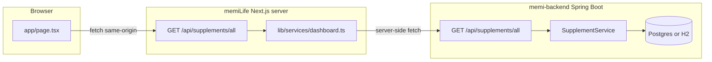

# MemiLife — โครงสร้างระบบ (หน้าบ้าน · หลังบ้าน · ฐานข้อมูล)

เอกสารนี้อธิบาย **สอง repo** ที่ทำงานคู่กัน: repo นี้คือ **memiLife** (Next.js) และ **memi-backend** (Spring Boot) โดยทั่วไป clone คู่กันบนเครื่อง (เช่น `C:\memiLife` กับ `C:\memi-backend`)

---

## 1) ภาพรวมและขอบเขต



- **หน้าบ้าน** โหลดข้อมูลผ่าน **`/api/supplements/all`** เท่านั้น (ไม่เรียก Railway/8080 ตรงจาก browser เพื่อเลี่ยง CORS และซ่อน URL จริงฝั่ง server ได้)
- **Next server** ดึงรายการจาก Spring แล้ว **จัดกอง noon/night** ก่อนส่ง JSON ให้ client
- **ฐานข้อมูล** ถูกดูแลโดย **Flyway** ใน memi-backend; entity JPA ต้องสอดคล้องกับคอลัมน์

---

## 2) Repository: memiLife (repo นี้)

### เทคโนโลยี

| ชั้น | เทคโนโลยี |
|-----|------------|
| Framework | Next.js **16** (App Router), React **19** |
| UI | Tailwind **4**, Radix UI, shadcn-style components ใต้ `components/ui/` |
| PWA | `@ducanh2912/next-pwa` (ดู `next.config.mjs`) |

### โครงสร้างโฟลเดอร์หลัก

```
memiLife/
├── app/
│   ├── layout.tsx              # root layout
│   ├── page.tsx                # dashboard (client); โหลด fetchDashboardData()
│   ├── providers.tsx
│   ├── globals.css
│   ├── manifest.ts
│   └── api/
│       └── supplements/
│           └── all/
│               └── route.ts    # GET → getDashboardPayload() → JSON DashboardPayload
├── components/
│   ├── dashboard/              # การ์ดแดชบอร์ด (header, fasting, supplements, …)
│   └── ui/                     # primitives (button, card, scroll-area, …)
├── lib/
│   ├── utils.ts
│   └── services/
│       └── dashboard.ts      # แหล่งความจริง: proxy URL, map API → UI, แบ่ง noon/night
├── hooks/
├── public/
├── scripts/
│   └── run-local.cjs           # Windows: เปิด Spring อีกหน้าต่าง + npm run dev
├── styles/                     # global styles เพิ่มเติม (ถ้ามี)
├── next.config.mjs
├── tsconfig.json
├── package.json
└── .env.example
```

### เส้นทางข้อมูล (dashboard supplements)

1. **`app/page.tsx`** (client) เรียก **`fetchDashboardData()`** จาก `lib/services/dashboard.ts`
2. ใน browser: **`fetch("/api/supplements/all", { cache: "no-store" })`**
3. **`app/api/supplements/all/route.ts`** เรียก **`getDashboardPayload()`** ซึ่ง:
   - resolve **backend origin** จาก env (ดูด้านล่าง)
   - `fetch(`${origin}/api/supplements/all`)` คาดหวัง **JSON array** จาก Spring
   - รัน **`buildDashboardFromRows()`** → โครงสร้าง **`DashboardPayload`** (`supplementStacks.noon` / `.night`)

### ตัวแปรสภาพแวดล้อม (memiLife)

| ตัวแปร | ใครอ่าน | ความหมาย |
|--------|----------|-----------|
| `MEMI_BACKEND_URL` | **เฉพาะ Next server** | Base ของ Spring; **ใช้เฉพาะ origin** (ตัด path เช่น `/api/v1` ออกใน `toHttpOriginOnly`) |
| `NEXT_PUBLIC_API_URL` | ลำดับรองสำหรับ origin + ใช้ hint ใน `logSupplement` | ถ้าไม่ตั้ง `MEMI_BACKEND_URL` อาจถูกใช้เป็น fallback ร่วมกับ dev default |
| `SUPPLEMENTS_API_ORIGIN` | server (fallback chain) | ทางเลือกเพิ่มใน `backendOriginForServer()` |

ลำดับความสำคัญโดยย่อในโค้ด: `MEMI_BACKEND_URL` → `SUPPLEMENTS_API_ORIGIN` → `NEXT_PUBLIC_API_URL` → ว่างแล้วใน **development** ใช้ `http://127.0.0.1:8080` → production ใช้ค่า default Railway ที่กำหนดใน `dashboard.ts` (ควรตั้ง env บน deploy จริง)

ไฟล์ตัวอย่าง: **`.env.example`**

### กฎการแบ่งกอง (noon / night)

นิยามใน **`lib/services/dashboard.ts`**:

- อ่านเวลาจาก **`doseTime`** หรือ **`dose_time`** เท่านั้น (รูปแบบ `HH:mm`)
- **05:00–16:59** → กองกลางวัน (**noon**)
- **17:00–04:59** (ข้ามเที่ยงคืน) → กองกลางคืน (**night**)
- ไม่มีค่า / parse ไม่ได้ → **noon**
- **`taken_time_slot` ไม่ใช้ในการแบ่งกอง**

### สคริปต์ `npm run local`

- ไฟล์: **`scripts/run-local.cjs`**
- ค้นหา backend ที่ **`../memi-backend`** จาก parent ของ memiLife หรือตั้ง **`MEMI_BACKEND_DIR`** เป็น path แบบ absolute
- Windows: สั่ง **`Start-Process mvnw.cmd spring-boot:run`** ใน working directory ของ backend แล้วรอ 5 วินาที จากนั้น **`npm run dev`**
- หมายเหตุ: สคริปต์ไม่ได้บังคับ profile **`h2`** — ขึ้นกับว่า backend ของคุณรันด้วย Postgres หรือ H2 (ดู memi-backend)

### สิ่งที่ยังไม่ persist

- **`logSupplement()`** ใน `dashboard.ts` ยังเป็น mock/console ไม่ได้ลดสต็อกผ่าน API

---

## 3) Repository: memi-backend (repo แยก)

โดยทั่วไป remote: `https://github.com/catBible/memi-backend.git` (ตรวจจาก `git remote` ในเครื่องคุณ)

### เทคโนโลยี

| ชั้น | เทคโนโลยี |
|-----|------------|
| Runtime | Java, **Spring Boot** |
| Build | Maven (`mvnw`, `pom.xml`) |
| ORM | Spring Data JPA + Hibernate (`ddl-auto=validate` ใน production) |
| DB migration | **Flyway** (`classpath:db/migration`) |
| API docs | springdoc / OpenAPI (`OpenApiConfig`) |
| Write protection | **`X-API-Key`** header เมื่อตั้ง `API_KEY` / `app.api.key` (`ApiKeyFilter`) |

### โครงสร้างแพ็กเกจ Java (`src/main/java/com/memi/lifeos/`)

```
com.memi.lifeos/
├── LifeOsBackendApplication.java      # entry
├── config/
│   ├── ApiKeyFilter.java               # writes ต้องมี API key (เมื่อกำหนด)
│   ├── SecurityConfig.java
│   ├── OpenApiConfig.java
│   └── DatabaseUrlEnvironmentPostProcessor.java   # แปลง DATABASE_URL (postgres://) → JDBC
├── web/
│   └── LivenessController.java         # health / probes
├── error/
│   └── GlobalExceptionHandler.java
└── supplement/
    ├── api/
    │   └── SupplementController.java   # @RequestMapping("/api/supplements")
    ├── entity/
    │   └── Supplement.java             # JPA entity ↔ ตาราง supplements
    ├── repository/
    │   ├── SupplementRepository.java
    │   └── SupplementQuerySpecs.java   # optional search q
    ├── service/
    │   └── SupplementService.java
    ├── dto/
    │   ├── SupplementResponse.java     # JSON ออก camelCase + @JsonAlias รับ snake_case
    │   ├── SupplementWriteRequest.java
    │   └── SupplementMapper.java
    └── H2SupplementDevSeed.java        # seed เมื่อ profile h2 และตารางว่าง (เงื่อนไขในโค้ด)
```

### REST API สรุป (`/api/supplements`)

| Method | Path | คำอธิบาย |
|--------|------|-----------|
| GET | `/api/supplements` | รายการแบบ **page** (+ optional `q`) |
| GET | `/api/supplements/all` | รายการ **ทั้งหมด** (ไม่ page) — ที่ dashboard ใช้ |
| GET | `/api/supplements/{id}` | รายการเดียว |
| POST | `/api/supplements` | สร้าง (ต้อง API key เมื่อเปิดใช้) |
| PUT | `/api/supplements/{id}` | แทนที่ทั้งก้อน |
| DELETE | `/api/supplements/{id}` | ลบ |

### การตั้งค่ารัน (`src/main/resources/`)

- **`application.properties`** — พอร์ต `PORT` หรือ 8080, Flyway เปิด, JPA `validate`, `app.api.key`, CORS patterns
- **`application-h2.properties`** — H2 in-memory, **Flyway ปิด**, JPA `update`, `app.api.key` สำหรับ dev
- **`local.properties`** — optional override (import แบบ optional จาก `application.properties`)
- **`local.properties.example`** — ตัวอย่าง

### การเชื่อม Postgres (Railway / cloud)

- ตั้ง **`DATABASE_URL`** แบบ `postgres://...` หรือ `postgresql://...`
- **`DatabaseUrlEnvironmentPostProcessor`** จะ map เป็น `spring.datasource.url` / username / password ก่อน boot ถ้ายังไม่มี `spring.datasource.url`

### SQL มือ (`memi-backend/db/manual/`)

- สคริปต์เสริมที่ไม่ผ่าน Flyway (เช่น **`add_supplement_dose_and_meal.sql`**) ใช้เมื่อต้องแก้ DB บน environment ที่มีอยู่แล้วด้วยมือ

---

## 4) ฐานข้อมูล — ตาราง `supplements`

### Flyway (ลำดับใน repo)

ไฟล์อยู่ที่ **`memi-backend/src/main/resources/db/migration/`**

| Version | ไฟล์ | หน้าที่โดยย่อ |
|---------|------|----------------|
| V1 | `V1__init_supplements.sql` | สร้างตารางเริ่มต้น (มีคอลัมน์ legacy เช่น `form`, `notes`, `created_at`) |
| V3 | `V3__supplements_lifeos_shape.sql` | ดึงรูปแบบให้ใกล้ production: `stock_remaining`, `taken_time_slot`, `last_taken_at`; ลบคอลัมน์เก่า |
| V4 | `V4__dose_time.sql` | เพิ่ม **`dose_time`** (VARCHAR 8, รูปแบบเวลา HH:mm) |
| V5 | `V5__meal_timing.sql` | เพิ่ม **`meal_timing`** (VARCHAR 32; ค่าแนะนำ `before` / `after`) |

หมายเหตุ: **ไม่มี V2** ใน repo ปัจจุบัน (ข้ามเลขเวอร์ชันเพื่อหลีกเลี่ยง conflict ตามคอมเมนต์ใน V3)

### คอลัมน์ที่สอดคล้องกับ `Supplement.java`

| DB column | Java field | หมายเหตุ |
|-----------|------------|---------|
| `id` | `Integer id` | SERIAL / identity |
| `name` | `name` | NOT NULL |
| `brand` | `brand` | |
| `dosage` | `dosage` | |
| `stock_remaining` | `stockRemaining` | NOT NULL, default 0 |
| `taken_time_slot` | `takenTimeSlot` | ป้ายกำกับเชิงข้อความ (ไม่ใช้แบ่งกองใน Next) |
| `dose_time` | `doseTime` | HH:mm สำหรับ logic กองกลางวัน/กลางคืน |
| `meal_timing` | `mealTiming` | เช่น `before` / `after` |
| `last_taken_at` | `lastTakenAt` | `Instant` → JSON ISO-8601 |

### H2 profile (`-Dspring-boot.run.profiles=h2`)

- Flyway **ปิด** — schema จาก JPA `update`
- **`H2SupplementDevSeed`** ใส่ข้อมูลตัวอย่างเมื่อยังไม่มีแถว (ถ้ามีข้อมูลเก่า seed จะไม่รันใหม่ — ต้องลบข้อมูลหรือล้าง DB ถ้าต้องการ reseed)

---

## 5) JSON สัญญาระหว่างระบบ

### Spring → Next (response item หลัก)

- ออกเป็น **camelCase** (`doseTime`, `mealTiming`, …) พร้อม **รับ snake_case** ใน request ผ่าน `@JsonAlias` ใน DTO (ดู `SupplementResponse` / `SupplementWriteRequest`)

### Next → Browser (`DashboardPayload`)

- ไม่ใช่ array ดิบ — เป็นอ็อบเจ็กต์ที่มี **`supplementStacks: { noon, night }`** แต่ละก้อนมี `items[]` เป็น **`SupplementStockItem`** (`id` เป็น string, `stock`, `doseTime`, …)

---

## 6) การพัฒนาและ deploy แบบสั้น

1. **Local full stack:** จาก memiLife รัน `npm run local` (หรือรัน Spring เองที่ 8080 แล้ว `npm run dev`)
2. **แก้ schema:** เพิ่ม `V{n}__....sql` ใน memi-backend → ปรับ entity/DTO/mapper/IT → push backend → ให้ environment รัน Flyway
3. **แก้การแบ่งกองหรือฟิลด์ UI:** memiLife `lib/services/dashboard.ts` + `components/dashboard/supplement-stack.tsx`
4. **Production Next:** ตั้ง **`MEMI_BACKEND_URL`** เป็น origin ของ API ที่ deploy แล้ว

---

## 7) Cursor skill

Skill ชื่อ **`memi-life-architecture`** อยู่ที่ **`.cursor/skills/memi-life-architecture/SKILL.md`** — ชี้มาที่เอกสารนี้และสรุปข้อควรจำสั้นๆ เพื่อให้ agent โหลดบริบทได้เร็วเมื่อทำงานกับ stack นี้
